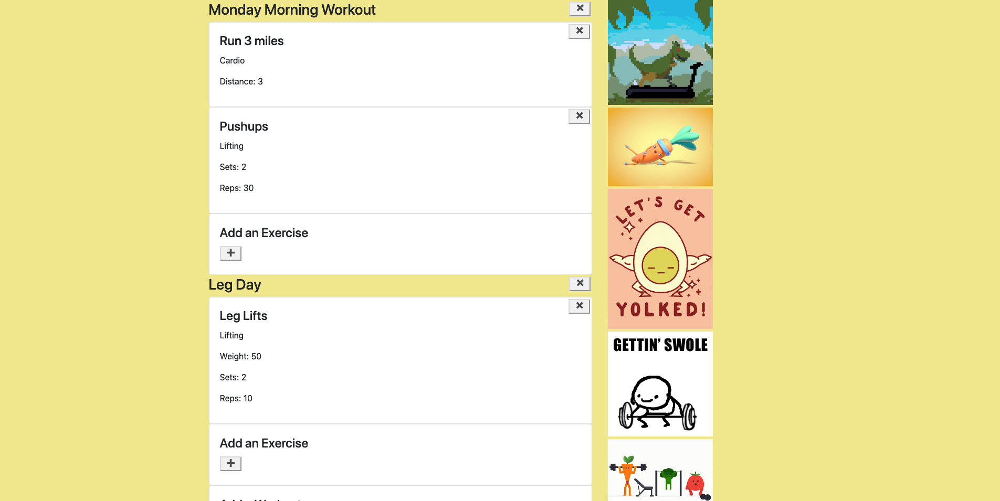

# the-great-exercise-planner

## Description
A web app that allows you to create workouts and add exercises to those workouts so you can keep track of your workout routine or design new routines.

## Usage
Simply navigate to the page. Click the add workout button and enter a name to add a workout. Once you have workout you can click the add an exercise button, select from Lifting, Cardio or Other and then fill in any of the fields to add the exercise (only the name is required).

## Technologies 
This app utilitizes the folowing technologies.
- Javascript
- HTML
- CSS
- Express
- Bootstrap
- Monogo DB
- Mongoose
- Jquery 

## Deployed Site
https://agile-island-34999.herokuapp.com
